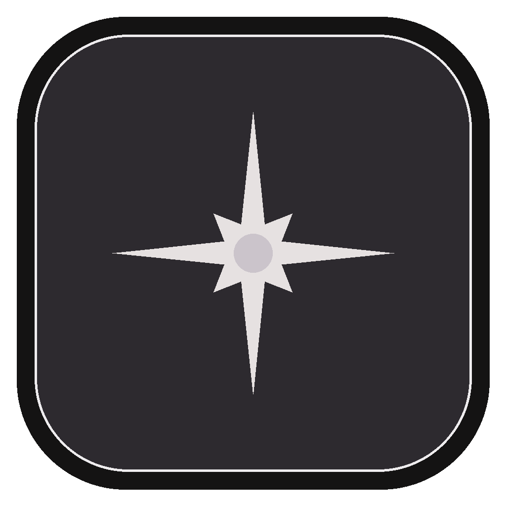
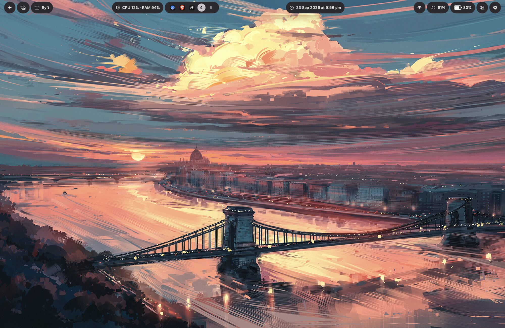
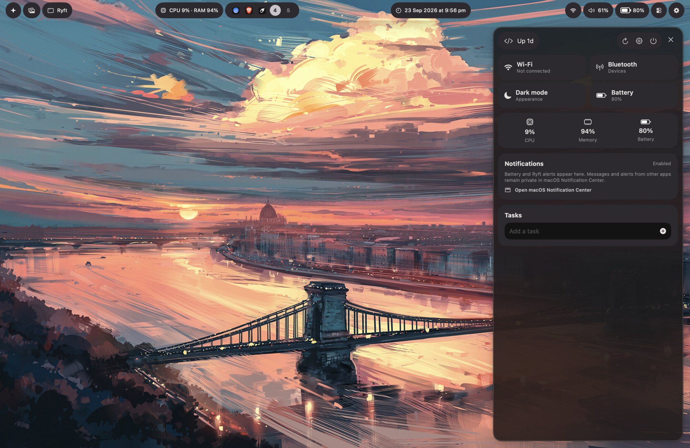
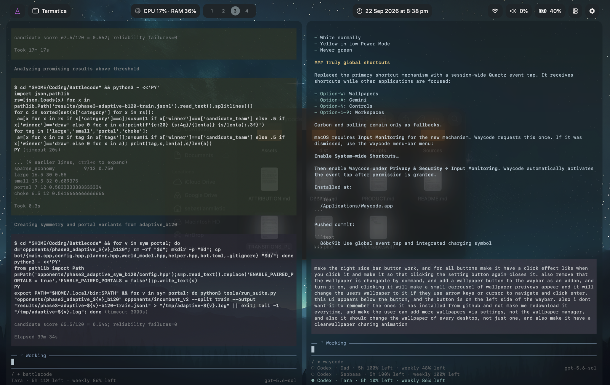
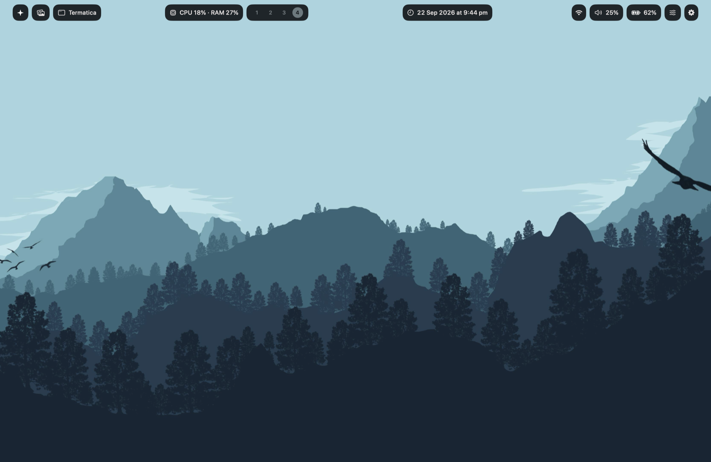
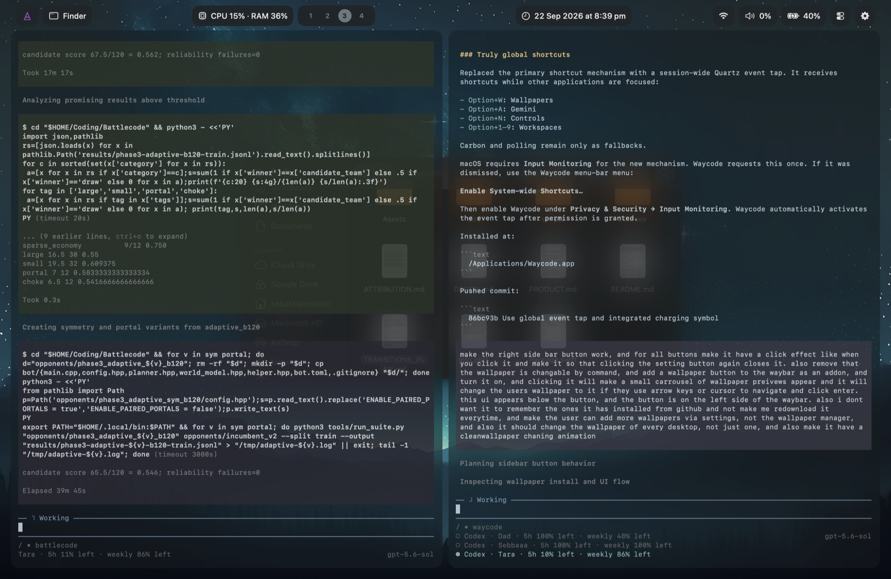
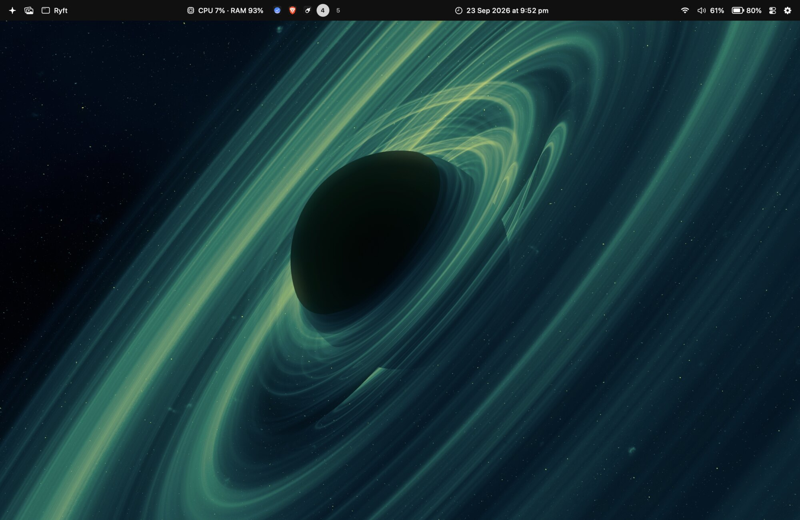
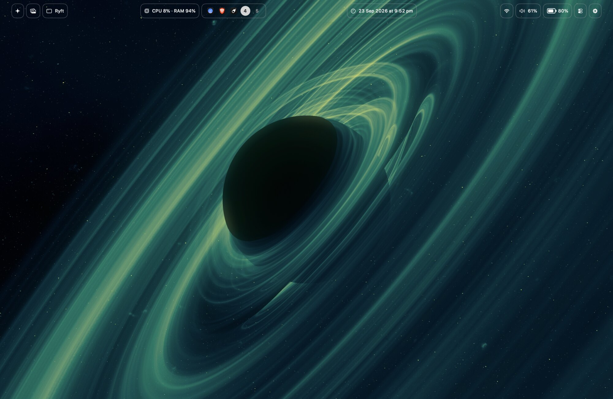
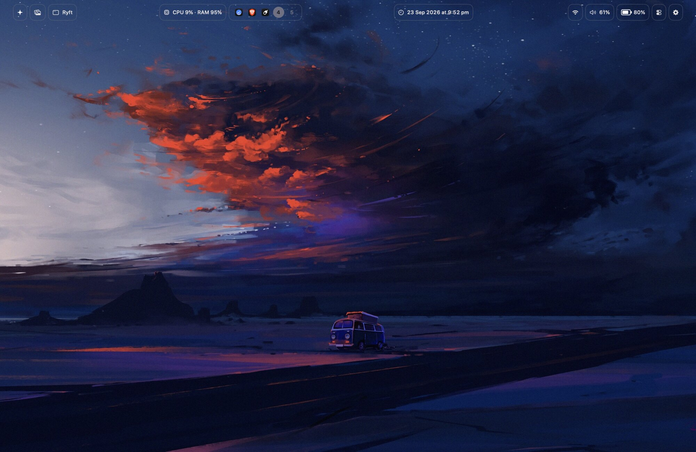
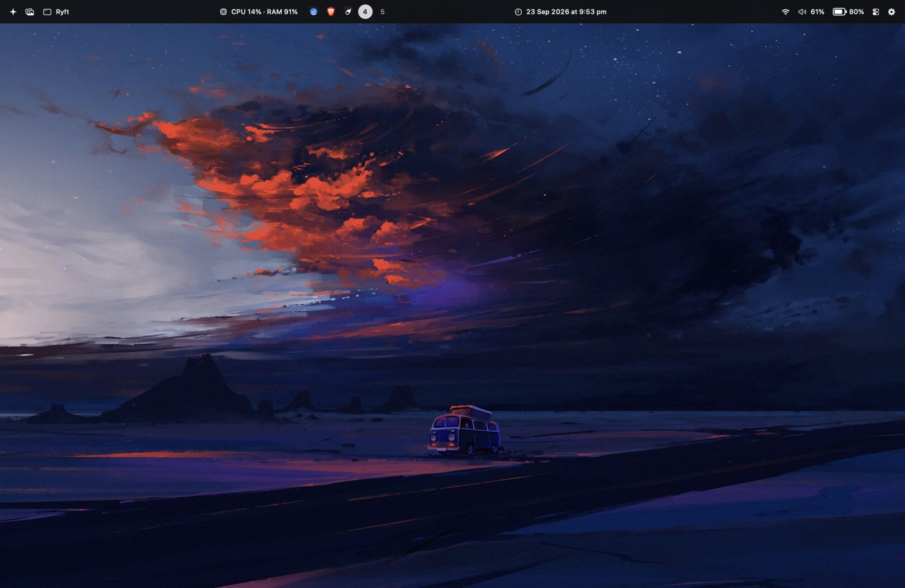

<p align="center">
  
</p>

# Ryft

<p align="center"><strong>A native Hyprland-shaped desktop environment for macOS.</strong></p>

<p align="center">
  <a href="https://github.com/sebastianmiletic/ryft/releases/latest"></a>
  
  
</p>

Ryft is a native macOS desktop bar and customization app inspired by Hyprland setups. It runs without a Dock icon, renders a notch-aware multi-display bar, and includes built-in Dwindle tiling, Mission Control workspace controls, live widgets, side panels, a wallpaper library, global shortcuts, Gemini, profiles, and a source-faithful Sebastian II Quickshell preset.



## Gallery

| Controls sidebar | Animated Dwindle layout |
| --- | --- |
|  |  |
|  |  |

## Bar styles

The same native renderer supports a continuous edge, individual modules, outlines, transparency, and full-width surfaces. Geometry, widgets, colors, and opacity remain independently configurable.

| Solid edge | Outlined modules |
| --- | --- |
|  |  |
| **Transparent outline** | **Flush full-width edge** |
|  |  |
| **Module islands** | |
|  | |

## Highlights

- Native AppKit and SwiftUI, no browser shell, SketchyBar, or background web service.
- Built-in animated Dwindle tiling with per-app exceptions and adjustable gaps.
- Notch-aware bar on the top, bottom, left, or right edge, with Floating, Touching edges, and Flush with edges styles.
- Live battery, Wi-Fi, sound, CPU, RAM, workspace apps, calendar, and shared tasks.
- Wallpaper carousel and gallery with cached thumbnails and per-Space application.
- Gemini assistant with local history and non-interactive Keychain credentials.
- Apple Silicon and Intel builds from the same source.

## Requirements

- macOS 13 or newer
- Swift 5.9 or newer to build

## Install

Download the matching ZIP from [Releases](https://github.com/sebastianmiletic/ryft/releases/latest):

- **Apple Silicon** for M1, M2, M3, M4, and newer Macs.
- **Intel** for Intel-based MacBook, iMac, Mac mini, and Mac Pro models.
- **Universal** when you want one bundle that runs on either architecture.

Unzip Ryft, move it to `/Applications`, then open it. macOS may ask you to confirm an app downloaded from the internet.

## Build and run

```bash
swift build
swift run Ryft
```

Build a signed local application bundle:

```bash
./scripts/build-app.sh
open dist/Ryft.app
```

Move `dist/Ryft.app` to `/Applications` to make Launch at Login registration available.

## First run

1. Open **Bar**, choose the top, bottom, left, or right display edge, then select **Floating**, **Touching edges**, or **Flush with edges**. Tune thickness, radius, inset, and opacity while the desktop bar updates live.
2. Ryft reads `NSScreen` safe areas on each display and keeps the center clear on MacBooks with a notch. Enable **Bar avoids notch** to stop the left and right surfaces before the camera area. The preview represents the protected spacing without drawing fake hardware.
3. **Sebastian II · 1:1** reproduces the source QML's 42pt base height, 5pt outer gap, 4pt center spacing, 18pt rounding, full `bb7de91` palette, source module order, and grouped status treatment. The style library shows one centered production-rendered `BarView` preview per row. Every preview follows the current notch-avoidance choices through spacing and splitting, without drawing a fake notch. Module islands and Nord intentionally have no enclosing bar box.
4. **Widgets avoid notch** reserves center space only for controls while keeping a continuous bar surface. **Bar avoids notch** splits the complete bar surface and widgets around the camera area. Enable **Black notch shelf** to paint the physical notch row with opaque RGB `0,0,0` and move the complete Ryft bar below it.
5. Open **Widgets** to edit the same `BarView` renderer used on the desktop. Drag widgets directly across Far left, Before notch, After notch, and Far right, or use the detailed controls. Every widget has its own SF Symbol or image, visibility, pill style, text color, background, typography, padding, radius, and click action.
6. Open **Tiling** to enable Ryft’s built-in Hyprland-style Dwindle engine. One resizable application fills the complete safe work area. Two applications receive equal left and right halves. A third keeps the left half intact and splits the right pane into two stacked halves; later applications recursively split the remaining pane along its longest axis. Frames adapt immediately when the bar moves between the top, bottom, left, or right, stop precisely below Ryft’s menu-bar wallpaper cover, and remain clear of the Dock. No helper app, download, extra menu-bar item, or competing shortcut system is used. Reduce Motion switches placement back to immediate updates.
7. Add a **Shell widget** to display the first output line from any local command on a configurable refresh interval. The battery widget uses 21 visual fill levels in 5% steps, keeps the real charge level while charging, and integrates the bolt into the gauge rather than displaying a falsely full battery. Power-source events update immediately with a one-second fallback refresh. Low Power Mode is changed through the accessible Battery Settings control and never invokes an administrator-password dialog.
8. Desktop buttons read the real ordered Mission Control Spaces every 50 ms and react directly to Space-change notifications. Occupied desktops show the circular icon of their first standard application while empty desktops retain their number. Application occupancy refreshes on launch, quit, hide, activation, and at a 150 ms fallback interval; icon and desktop insertion/removal use short Reduce-Motion-aware transitions. With the optional Screen Recording grant, Ryft-initiated switches use a 220 ms outgoing-desktop slide over a direct SkyLight Space change while the bar remains fixed. Settings closes automatically when the active Space changes.
9. The enabled **Wallpaper** add-on sits on the far left of the bar. Its palette-driven SwiftUI carousel has no generic title bar or loading spinner. Left/Right selects a preview and Return applies it to the current desktop. Down moves keyboard focus to the two apply actions, Left/Right chooses one, Return activates it, and Up returns to previews. **Apply to all desktops** visits every ordinary SkyLight-managed Mission Control Space, writes the wallpaper with `NSWorkspace`, and restores the originally active Spaces; it does not depend on Control-number shortcuts or System Events exposing only the current desktop.
10. Wallpaper command shortcuts, including Option+W and Random Wallpaper, are removed from configuration and the keybind editor. Option+A and Option+N remain system-wide sidebar shortcuts. Command+M captures one temporary in-memory frame of the display under the pointer and asks Gemini to answer its primary visible question. Multiple-choice results replace the top-left sparkle with the answer letter; short free-form answers expand beside the sparkle and move neighboring widgets naturally. The frame is sent only after the shortcut is pressed, is never written to disk, and is released after the request.
11. The assistant control is a simple white, rounded four-point sparkle. Gemini routes requests through currently supported Gemini 2.5 Flash, Gemini 2.5 Flash Lite, and Gemini 2.0 Flash models, displays model usage and token counts, preserves local conversation history, and supports new chat, copy, and stop controls. The API key uses a non-interactive Keychain account so opening or using Gemini never requests the Mac login password. The source prompt behavior, temperature 0.5, macOS context substitutions, and output rules are preserved.
12. The Transparency control is expressed in the expected direction: 0% is opaque and 100% is transparent. The experimental stationary bar stays above macOS Space motion. Optional Blur uses a cached wallpaper-backed texture instead of `NSVisualEffectView`. Changes save automatically to `~/Library/Application Support/Ryft/config.json`.
13. Ryft never opens a Location prompt at launch. After Location has been granted explicitly, nearby networks preload in the background. Saved macOS networks connect without another password; unknown secured networks reveal a password field only when selected. The custom Wi-Fi and sound panels dismiss on outside click and use themed animated controls instead of native dropdown menus.
14. The first launch opens a concise, skippable Permissions and Quick Start flow. Those onboarding tabs disappear after completion; relevant experimental permissions remain available in General. The compact semi-transparent settings workbench gives custom buttons, navigation items, wallpapers, themes, and style previews consistent hover and press feedback.
15. Use the Ryft icon in the macOS menu bar, or the gear widget in the desktop bar, to reopen settings after closing the window. Each opening lands on a one-time navigation home view showing the active wallpaper and clean Mac, system, memory, processor, display, and uptime specifications; Overview is intentionally absent from the settings navigation.
16. General includes an optional compact black Bibata pointer matching the source Hyprland setup. Because macOS has no cursor-theme API, Ryft implements it as an experimental global pointer overlay and restores the native cursor immediately when disabled or when Ryft quits. macOS does not expose a supported way to replace the native four-finger Mission Control animation; trackpad transitions retain Apple’s timing with the Ryft bar held stationary.
17. Clicking the clock opens a themed split calendar and task panel. Tasks are shared with the Controls sidebar and persist with the rest of the configuration.

While Ryft runs, it hides the native menu bar. When the Ryft bar is moved away from the top edge, a separate click-through wallpaper cover remains over the native menu-bar area so it cannot bleed through. Native menu-bar visibility is restored when Ryft quits. Side panels avoid whichever edge the Ryft bar occupies; Gemini stays open until explicitly dismissed, while Controls uses a longer inactivity timeout. The wallpaper manager dismisses on any outside click and uses shared, coalesced thumbnail caching instead of repeatedly decoding full-resolution files. The resource popover aggregates each application’s helper processes, shows its real icon, CPU load, resident-memory bytes, and physical-memory percentage, and refreshes once per second.

## Permissions

Ryft requests access only after an explicit user action. Accessibility powers tiling and control actions; Input Monitoring powers global shortcuts; Location lets macOS reveal Wi-Fi names; Notifications show Ryft battery warnings; Screen Recording provides temporary workspace-transition frames and the explicit Command+M visual-answer capture. General Settings shows a red status dot while access is missing.

## Configuration

Ryft stores configuration at:

```text
~/Library/Application Support/Ryft/config.json
```

Profiles can be imported and exported from the General screen. No web server, JavaScript runtime, SketchyBar installation, or Linux compatibility layer is used.

## Upstream preset

See [ATTRIBUTION.md](ATTRIBUTION.md). The upstream repository uses Quickshell rather than Waybar. Ryft ports the real module arrangement and palette to native macOS behavior.
